# Nueva Arquitectura de Agentes - Separación de Responsabilidades

## 🎯 Filosofía de Diseño

**Principio clave:** Los agentes LLM NO deben hacer scraping. Los agentes trabajan con datos ya extraídos.

### ❌ Arquitectura Anterior (Ineficiente)
```
Agente → Scraping HTML → Parsing → Análisis → Recomendación
  └─ LLM costoso haciendo trabajo de parser
```

### ✅ Nueva Arquitectura (Eficiente)
```
Scraper (Python puro) → Datos limpios
                           ↓
              Agente 1 (LLM): Filtrado inteligente
                           ↓
              Stats (Python puro): Matemáticas
                           ↓
              Agente 2 (LLM): Recomendación estratégica
```

---

## 📊 Diagrama de Flujo Completo

```mermaid
flowchart TB
    Start([Usuario solicita análisis de precio]) --> Input[/Producto: Sony WH-1000XM5 audífonos/]
    
    Input --> Step1[📋 PASO 1: Web Scraping]
    
    subgraph Scraper ["MLWebScraper (Python Puro - Sin LLM)"]
        Step1 --> Parse1{Identificar<br/>marca y modelo}
        Parse1 --> URL[Construir URL de búsqueda]
        URL --> HTTP[Hacer petición HTTP]
        HTTP --> HTML[Recibir HTML completo]
        HTML --> Extract{Estrategia de<br/>extracción}
        Extract -->|Opción 1| JSONLD[Extraer JSON-LD<br/>del HTML]
        Extract -->|Opción 2| PreloadedState[Extraer __PRELOADED_STATE__<br/>JavaScript object]
        JSONLD --> Parse2[Parsear y normalizar ofertas]
        PreloadedState --> Parse2
        Parse2 --> Result1[/21 ofertas extraídas<br/>~1.5 segundos/]
    end
    
    Result1 --> Step2[🤖 PASO 2: Clasificación]
    
    subgraph Matching ["ProductMatchingAgent (LLM - gpt-4o-mini)"]
        Step2 --> Batch[Dividir en batches<br/>de 20 ofertas]
        Batch --> LLM1[Llamada LLM 1:<br/>Clasificar batch 1]
        Batch --> LLM2[Llamada LLM 2:<br/>Clasificar batch 2]
        LLM1 --> Class1[Comparable/Accesorio/<br/>Bundle/No comparable]
        LLM2 --> Class1
        Class1 --> Filter[Filtrar solo comparables]
        Filter --> Result2[/21 comparables, 0 excluidos<br/>~26 segundos<br/>Temp: 0.1/]
    end
    
    Result2 --> Step3[📈 PASO 3: Análisis Estadístico]
    
    subgraph Stats ["Stats Module (Python Puro - Sin LLM)"]
        Step3 --> IQR[Método IQR para outliers]
        IQR --> Bounds[Calcular Q1, Q3, IQR<br/>Lower bound = Q1 - 1.5*IQR<br/>Upper bound = Q3 + 1.5*IQR]
        Bounds --> Remove[Remover 3 outliers]
        Remove --> Calc[Calcular estadísticas:<br/>- Min, Max, Median<br/>- Q1, Q3, Mean<br/>- Por condición]
        Calc --> Result3[/Mediana: $4,999 MXN<br/>Q1: $4,969, Q3: $6,099<br/>~0.1 segundos/]
    end
    
    Result3 --> Step4[💰 PASO 4: Recomendación]
    
    subgraph Pricing ["PricingIntelligenceAgent (LLM - gpt-4o)"]
        Step4 --> Strategy{Determinar estrategia}
        Strategy -->|spread_ratio < 0.2| Competitive[Estrategia COMPETITIVE]
        Strategy -->|0.2 ≤ ratio ≤ 0.5| Balanced[Estrategia BALANCED]
        Strategy -->|ratio > 0.5| Value[Estrategia VALUE/PREMIUM]
        
        Competitive --> Calc2[Precio = Mediana<br/>Alternativas: ±5%, ±15%]
        Balanced --> Calc2
        Value --> Calc2
        
        Calc2 --> Risk[Evaluar riesgos:<br/>- Tamaño de muestra<br/>- Outliers<br/>- Condición]
        Risk --> Result4[/Precio: $4,999 MXN<br/>Confianza: 80%<br/>Alternativas calculadas/]
    end
    
    Result4 --> Output[/📄 Recomendación Final/]
    Output --> Display{Mostrar resultados}
    
    Display --> Price[💰 Precio recomendado: $4,999]
    Display --> Position[📍 Posición: Mediana del mercado]
    Display --> Alternatives[🔄 Alternativas:<br/>Agresivo: $4,720<br/>Conservador: $4,999<br/>Premium: $5,794]
    Display --> Risks[⚠️ Factores de riesgo]
    
    Price --> End([✅ Análisis completado<br/>Duración total: ~28 segundos])
    Position --> End
    Alternatives --> End
    Risks --> End
    
    style Scraper fill:#e1f5ff,stroke:#0288d1,stroke-width:2px
    style Matching fill:#fff3e0,stroke:#f57c00,stroke-width:2px
    style Stats fill:#e8f5e9,stroke:#388e3c,stroke-width:2px
    style Pricing fill:#fce4ec,stroke:#c2185b,stroke-width:2px
    style Result1 fill:#b3e5fc,stroke:#0288d1,stroke-width:2px
    style Result2 fill:#ffe0b2,stroke:#f57c00,stroke-width:2px
    style Result3 fill:#c8e6c9,stroke:#388e3c,stroke-width:2px
    style Result4 fill:#f8bbd0,stroke:#c2185b,stroke-width:2px
```



### 🔍 Detalles del Flujo

| Paso | Componente | Tipo | Duración | LLM | Costo Relativo |
|------|-----------|------|----------|-----|----------------|
| 1 | MLWebScraper | Python | ~1.5s | ❌ No | $0 |
| 2 | ProductMatchingAgent | LLM | ~26s | ✅ gpt-4o-mini | $ |
| 3 | Stats Module | Python | ~0.1s | ❌ No | $0 |
| 4 | PricingIntelligenceAgent | LLM | ~0.7s | ✅ gpt-4o | $$ |
| **Total** | **Pipeline completo** | **Híbrido** | **~28s** | **2 agentes** | **~52% menos** |

### 💡 Ventajas de la Nueva Arquitectura

1. **Reducción de costos**: 48% menos llamadas LLM (antes: 4 agentes, ahora: 2 agentes)
2. **Mayor velocidad**: Parsing y stats en milisegundos vs segundos
3. **Mejor confiabilidad**: Parsing determinista, no depende de interpretación LLM
4. **Escalabilidad**: Scraping y stats pueden procesar miles de productos sin costo LLM
5. **Separación de concerns**: Cada módulo tiene una responsabilidad clara
6. **Búsqueda inteligente**: SearchStrategyAgent encuentra competidores por specs, no por marca

---

## 🆕 Actualización: Modo Producto Pivote (Enero 2026)

### Nuevo Flujo para Productos Rebrandeados

**Problema**: Importas productos de China y los rebrandeas. Necesitas encontrar competidores con características similares pero marcas diferentes.

**Solución**: Pipeline extendido con SearchStrategyAgent

```
[URL del Producto Pivote]
         ↓
[0. ProductDetails Extractor]
   Extrae: título, precio, specs técnicos, atributos
         ↓
[1. SearchStrategyAgent (LLM)]
   Analiza specs → Genera búsquedas SIN marca
   "Bocina Louder 5\" 10W" → "bocina techo 5 pulgadas 10W instalación"
         ↓
[2. MLWebScraper]
   Busca con términos optimizados
         ↓
[3. ProductMatchingAgent (LLM)]
   Filtra productos con specs comparables
         ↓
[4. Stats Module]
   Análisis estadístico
         ↓
[5. PricingIntelligenceAgent (LLM)]
   Recomendación de precio
```

### Ejemplo Real: Bocina Louder YPO-900RED

**Input**:
```python
url = "https://www.mercadolibre.com.mx/bocina-techo-louder-ypo-900red-5-pulgadas-ambientales-10w-linea-70-100v/p/MLM50988032"
```

**Paso 0 - Extracción**:
```json
{
  "title": "Bocina Techo Louder YPO-900RED",
  "brand": "Louder",
  "price": 549.00,
  "attributes": {
    "Tamaño": "5 pulgadas",
    "Potencia": "10W",
    "Línea": "70-100V",
    "Tipo": "Empotrada"
  }
}
```

**Paso 1 - Estrategia de Búsqueda (LLM)**:
```json
{
  "primary_search": "bocina techo 5 pulgadas 10W instalacion empotrada",
  "alternative_searches": [
    "altavoz techo 5 pulgadas ambiental",
    "speaker empotrable 5 inch 10 watts",
    "bocina instalacion line 70v 100v"
  ],
  "key_specs": ["5 pulgadas", "10W", "línea 70-100V", "empotrada"],
  "reasoning": "Enfoque en especificaciones técnicas que permiten comparar funcionalmente productos sin importar la marca"
}
```

**Paso 2 - Scraping**:
- Busca: "bocina techo 5 pulgadas 10W instalacion empotrada"
- Encuentra: 25-30 productos de diferentes marcas

**Paso 3-5**: Filtrado, estadísticas y recomendación (igual que antes)

---

## 🏗️ Componentes del Sistema

### 1. MLWebScraper (Sin LLM)
**Archivo:** [`backend/app/mcp_servers/mercadolibre/scraper.py`](../backend/app/mcp_servers/mercadolibre/scraper.py)

**Responsabilidad:**
- Extraer productos del HTML de Mercado Libre
- Parsear `__PRELOADED_STATE__` o JSON-LD
- Normalizar datos
- **NO usa LLM** - es parsing puro

**Entrada:**
```python
description: "Sony WH-1000XM5 audífonos"
```

**Salida:**
```python
ScrapingResult(
    offers=[
        Offer(title="...", price=5999.0, condition="new", ...),
        Offer(title="...", price=5499.0, condition="used", ...),
        ...
    ]
)
```

**Ventajas:**
- ⚡ Rápido (sin llamadas LLM)
- 💰 Gratis (no consume tokens)
- 🔄 Reutilizable (cache-friendly)

---

### 2. ProductMatchingAgent (LLM)
**Archivo:** [`backend/app/agents/product_matching.py`](../backend/app/agents/product_matching.py)

**Responsabilidad:**
- Recibir lista de productos scraped
- Clasificar cuáles son **comparables** al producto objetivo
- Filtrar accesorios, bundles, productos diferentes
- **USA LLM** para entender semántica

**Entrada:**
```python
target_product: "Sony WH-1000XM5"
raw_offers: [
    {"title": "Sony WH-1000XM5 Negro", "price": 5999},
    {"title": "Funda Sony WH-1000XM5", "price": 299},
    {"title": "Sony WH-1000XM4", "price": 4999},
]
```

**Salida:**
```python
{
    "comparable_offers": [
        {"title": "Sony WH-1000XM5 Negro", "price": 5999}
    ],
    "excluded_count": 2,
    "classifications": [...]
}
```

**Por qué LLM:**
- 🧠 Entiende variantes (color, capacidad)
- 🔍 Detecta accesorios sutiles
- 📦 Identifica bundles complejos

---

### 3. Statistical Analysis (Sin LLM)
**Archivo:** [`backend/app/mcp_servers/mercadolibre/stats.py`](../backend/app/mcp_servers/mercadolibre/stats.py)

**Responsabilidad:**
- Calcular estadísticas de precios
- Remover outliers (IQR method)
- Agrupar por condición (nuevo/usado)
- **NO usa LLM** - es matemáticas puras

**Entrada:**
```python
offers: [Offer(...), Offer(...), ...]
```

**Salida:**
```python
{
    "overall": {
        "median": 5799.0,
        "q1": 5499.0,
        "q3": 5999.0,
        "outliers_removed": 2
    },
    "by_condition": {
        "new": {"median": 5899.0, ...},
        "used": {"median": 4999.0, ...}
    }
}
```

**Ventajas:**
- ⚡ Instantáneo
- 🎯 Preciso (matemáticas exactas)
- 📊 Reproducible

---

### 4. PricingIntelligenceAgent (LLM)
**Archivo:** [`backend/app/agents/pricing_intelligence.py`](../backend/app/agents/pricing_intelligence.py)

**Responsabilidad:**
- Recibir estadísticas calculadas
- Analizar contexto de mercado
- Recomendar precio óptimo con **justificación**
- Generar escenarios alternativos
- **USA LLM** para razonamiento estratégico

**Entrada:**
```python
target_product: "Sony WH-1000XM5"
statistics: {
    "overall": {"median": 5799.0, ...},
    "by_condition": {...}
}
```

**Salida:**
```python
{
    "recommended_price": 5749.0,
    "confidence": 0.85,
    "strategy": "competitive",
    "reasoning": "Basado en mediana de $5,799 con 23 ofertas...",
    "market_position": "Positioned at 45% within IQR",
    "risk_factors": ["Market data stable", ...],
    "alternative_prices": {
        "aggressive": 5399.0,
        "conservative": 5799.0,
        "premium": 5999.0
    }
}
```

**Por qué LLM:**
- 🎯 Razonamiento estratégico
- 📝 Justificaciones en lenguaje natural
- 🔄 Considera múltiples factores simultáneamente

---

## 🔄 Flujo Completo

### PricingPipeline - Orquestador
**Archivo:** [`backend/app/agents/pricing_pipeline.py`](../backend/app/agents/pricing_pipeline.py)

```
Input: "Sony WH-1000XM5 audífonos"
   ↓
┌──────────────────────────────────────────┐
│ STEP 1: Scrape HTML (3-5 seg)           │
│ - MLWebScraper.search_products()         │
│ - Output: 25 ofertas crudas              │
└───────────────┬──────────────────────────┘
                ↓
┌───────────────┴──────────────────────────┐
│ STEP 2: Filter Products (2-3 seg LLM)   │
│ - ProductMatchingAgent.execute()         │
│ - Output: 18 ofertas comparables         │
└───────────────┬──────────────────────────┘
                ↓
┌───────────────┴──────────────────────────┐
│ STEP 3: Calculate Stats (<1 seg)        │
│ - get_price_recommendation_data()        │
│ - Output: Estadísticas + IQR            │
└───────────────┬──────────────────────────┘
                ↓
┌───────────────┴──────────────────────────┐
│ STEP 4: Recommend Price (3-4 seg LLM)   │
│ - PricingIntelligenceAgent.execute()     │
│ - Output: Precio + justificación        │
└──────────────────────────────────────────┘
   ↓
Output: Complete Analysis (~10 segundos total)
```

---

## 📊 Comparación de Arquitecturas

| Aspecto | Anterior | Nueva |
|---------|----------|-------|
| **Scraping** | Agente LLM | Python puro |
| **Costo** | 🔴 Alto (tokens LLM) | 🟢 Bajo (solo 2 pasos LLM) |
| **Velocidad** | 🔴 Lento (LLM en todo) | 🟢 Rápido (LLM solo donde importa) |
| **Calidad** | 🟡 Variable | 🟢 Alta (especialización) |
| **Debuggable** | 🔴 Difícil | 🟢 Fácil (logs claros) |
| **Mantenible** | 🔴 Complejo | 🟢 Simple (responsabilidades claras) |

---

## 💰 Análisis de Costos

### Por Análisis de Producto

**Arquitectura Anterior:**
```
Scraping (LLM): 1,500 tokens × $0.10/1M = $0.15
Análisis (LLM): 2,000 tokens × $0.10/1M = $0.20
Total: ~$0.35 por producto
```

**Nueva Arquitectura:**
```
Scraping (Python): 0 tokens = $0.00
Matching (LLM): 800 tokens × $0.10/1M = $0.08
Stats (Python): 0 tokens = $0.00
Recommendation (LLM): 1,000 tokens × $0.10/1M = $0.10
Total: ~$0.18 por producto
```

**Ahorro: ~48%** 💰

---

## 🚀 Uso

### Análisis Simple
```python
from backend.app.agents.pricing_pipeline import quick_price_analysis

result = await quick_price_analysis("Sony WH-1000XM5")

print(f"Precio recomendado: ${result['final_recommendation']['recommended_price']:,.2f}")
```

### Pipeline Completo
```python
from backend.app.agents.pricing_pipeline import PricingPipeline

pipeline = PricingPipeline()
result = await pipeline.analyze_product(
    product_description="Sony WH-1000XM5 audífonos",
    max_offers=25
)
```

### Demo Script
```bash
python scripts/demo_new_pipeline.py
```

---

## 🎯 Ventajas de esta Arquitectura

### 1. Separación de Responsabilidades
- ✅ Cada componente hace UNA cosa bien
- ✅ Fácil de testear individualmente
- ✅ Fácil de reemplazar componentes

### 2. Eficiencia
- ✅ LLM solo donde agrega valor
- ✅ Parsing y matemáticas en Python puro
- ✅ Cache-friendly (scraping separado)

### 3. Escalabilidad
- ✅ Paralelizable (batch processing)
- ✅ Rate limiting controlado
- ✅ Costos predecibles

### 4. Mantenibilidad
- ✅ Logs claros por etapa
- ✅ Debugging simple
- ✅ Fácil agregar features

---

## 📝 Próximos Pasos

### Mejoras Inmediatas
- [ ] Structured output para classification (evitar parsing)
- [ ] Cache Redis para scraping results
- [ ] Retry logic con exponential backoff
- [ ] User-agent rotation

### Features Futuras
- [ ] Historical price tracking
- [ ] Competitor monitoring
- [ ] Price alert system
- [ ] A/B testing de estrategias

---

## 🔗 Archivos Relacionados

- **Scraper:** [`backend/app/mcp_servers/mercadolibre/scraper.py`](../backend/app/mcp_servers/mercadolibre/scraper.py)
- **Models:** [`backend/app/mcp_servers/mercadolibre/models.py`](../backend/app/mcp_servers/mercadolibre/models.py)
- **Stats:** [`backend/app/mcp_servers/mercadolibre/stats.py`](../backend/app/mcp_servers/mercadolibre/stats.py)
- **Matching Agent:** [`backend/app/agents/product_matching.py`](../backend/app/agents/product_matching.py)
- **Pricing Agent:** [`backend/app/agents/pricing_intelligence.py`](../backend/app/agents/pricing_intelligence.py)
- **Pipeline:** [`backend/app/agents/pricing_pipeline.py`](../backend/app/agents/pricing_pipeline.py)
- **Demo:** [`scripts/demo_new_pipeline.py`](../scripts/demo_new_pipeline.py)

---

**Fecha:** 2025-01-04  
**Estado:** ✅ Implementado y listo para testing
